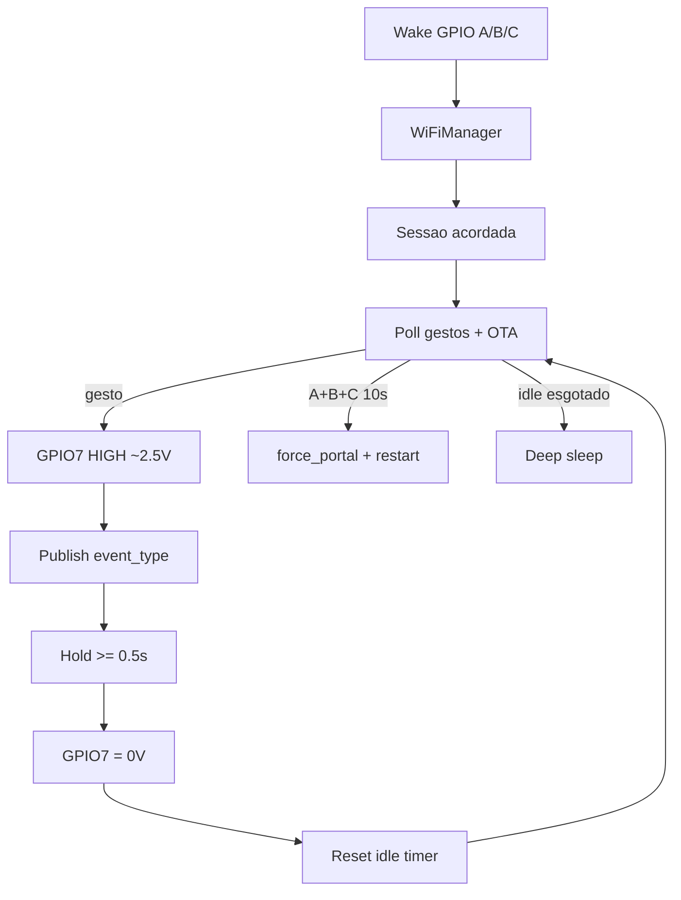

# Arquitetura

**Idioma:** [Português](arquitetura.md) · [English](en/architecture.md)

## Fluxo

## Módulos

| Arquivo | Função |
|---------|--------|
| `src/main.cpp` | Sessão acordada, idle timer, orquestra OTA/MQTT/efeito |
| `src/buttons.cpp` | Poll de gestos A/B/C + config chord |
| `src/wifi_setup.cpp` | WiFiManager, NVS, force_portal |
| `src/mqtt_ha.cpp` | Discovery + publish `event` |
| `src/ota_update.cpp` | ArduinoOTA |
| `src/effect_out.cpp` | PWM GPIO7 on/off ~2,5 V (hold ≥0,5 s) |
| `src/status_led.cpp` | LED onboard GPIO8 |

## Persistência NVS (`habutton`)

MQTT, nomes, `sleep_delay`, `ota_pass`, `force_portal`, `disc_done`.

## MQTT

- Discovery: `homeassistant/event/{deviceId}/config` (retained), com IP em `configuration_url` / `connections`.
- Estado: `{device}/{mac}/event` com `{"event_type":"..."}`.
- Configs (switch/number/text) via discovery clássico + `{base}/…/set` enquanto acordado.
- Conexão mantida durante a sessão; discovery republicado se config mudar.

## Energia / efeito

- Efeito só durante publish MQTT.
- Deep sleep após idle; wake GPIO4|5|3 nível baixo (só GPIO0–5 no C3).
