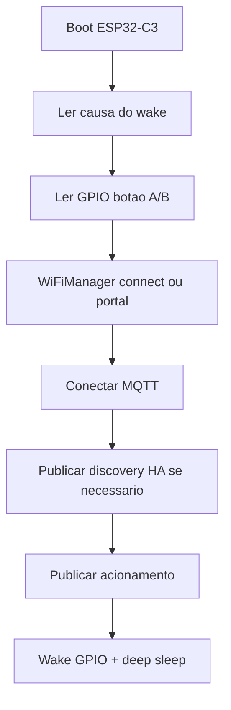

# Arquitetura

## Visão geral

O firmware executa um ciclo único em `setup()` e não permanece em `loop()`: após Wi‑Fi + MQTT, entra em deep sleep até o próximo acionamento.

## Módulos

| Arquivo | Responsabilidade |
|---------|------------------|
| `src/main.cpp` | Orquestra boot → Wi‑Fi → MQTT → sleep |
| `src/buttons.cpp` | Leitura dos pinos, janela “ambos”, deep sleep |
| `src/wifi_setup.cpp` | WiFiManager, parâmetros customizados, NVS |
| `src/mqtt_ha.cpp` | PubSubClient, device discovery + eventos MQTT |
| `include/config.h` | Pinos, timeouts e defaults |

## Wake e botões

- Causa `ESP_SLEEP_WAKEUP_GPIO`: leitura imediata de GPIO4/GPIO5 (ativo em nível baixo).
- Janela de ~80 ms (`BUTTON_BOTH_WINDOW_MS`) para detectar o segundo botão em acionamento próximo.
- Antes de dormir: espera soltar os botões (até ~3 s) para evitar wake em laço.

## Persistência (NVS)

Namespace `habutton`:

- Credenciais/parâmetros MQTT e nomes (`mqtt_host`, `mqtt_port`, …).
- Prefixo de discovery vazio é rejeitado e volta para `homeassistant`.

As credenciais de Wi‑Fi ficam a cargo do WiFiManager (armazenamento próprio).

## MQTT / Home Assistant

- **Discovery single-component (retained), a cada wake:**  
  `homeassistant/event/{deviceId}_{btn}/config`  
  Campos: `unique_id`, `state_topic`, `event_types`, `device` (identifiers + MAC), `origin`.
- **Evento (não retained):**  
  `{device_name}/{mac}/{btn}/event` → `{"event_type":"press"}`  
  Fora do prefixo `homeassistant/` de propósito.
- Broker precisa de ACL de escrita em `homeassistant/#`.

Contadores temporais no HA: [homeassistant-contadores.md](homeassistant-contadores.md).
Checklist de discovery: [configuracao.md](configuracao.md).

## Energia

- Após publicar: `WiFi.disconnect` + `WIFI_OFF` + `esp_deep_sleep_start()`.
- Wake configurado com máscara GPIO4|GPIO5, nível baixo (`ESP_GPIO_WAKEUP_GPIO_LOW`).
- Em falha de Wi‑Fi após timeout do portal (~90 s): dorme para preservar bateria.
