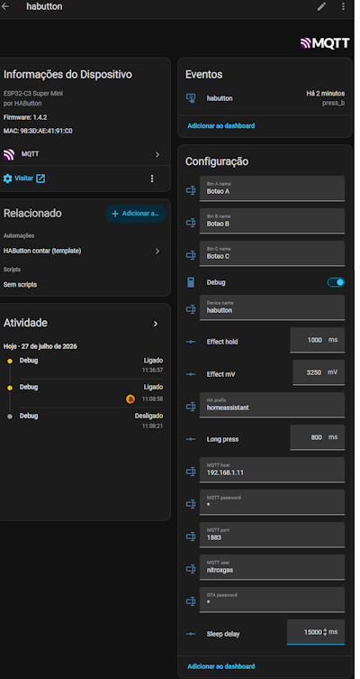

# HAButton Documentation (English)

**Language:** [English](README.md) · [Português](../README.md)

A quick project designed to repurpose used vapes into something useful: sending events to Home Assistant. It uses a small microcontroller powered by the vape's circuitry to monitor three mechanical switches. 
When one or more buttons are pressed, the device wakes up, connects to Wi-Fi, and publishes its status via MQTT. 
Home Assistant automatically recognizes the device and can be programmed to trigger automations based on the event data.

This is a quick weekend project—a first version with plenty of room for improvement.

Build a similar one with whatever vapes you can get your hands on; it’s a great way to repurpose the electronic waste they generate.

The project powers an ESP32-C3 using the wires originally intended for the vape's pressure sensor. 
Optionally, it uses the sensor's return wire to signal usage to the vape itself, in case the unit has a display or animated LED.
I use the ESP32-C3's GPIOs configured for interrupts to wake the device from deep sleep and send events via MQTT.
For the switches, I use three standard mechanical ones.
On the first boot, the device starts an Access Point to receive initial Wi-Fi settings and other configurations. Once connected to Wi-Fi and publishing data to Home Assistant via MQTT, settings can be adjusted directly through the interface. 
It supports simple OTA updates, allowing for development and deployment while powered by the vape. 
**Remember, you must "wake up" the device for it to receive configuration changes via MQTT or OTA.**

### **NEVER CONNECT THE USB WHILE THE VAPE POWER IS CONNECTED; THIS COULD DAMAGE YOUR USB PORT.**

You will need:
A used, disassembled vape. Be careful during disassembly— **I recommend wearing gloves and safety goggles and immediately disposing of any wet components, as they contain nicotine that can irritate the skin.** For this build, I used a G30k-Pro, but almost all of them work the same way: reading a pressure sensor and powering heating coils to generate vapor.  
ESP32-C3 Super Mini. 3 mechanical switches (or any other available buttons);  
Wires and other components for the connections;  
And a case—in this instance, I modeled a simple one and 3D printed it; [MakerWorld](https://makerworld.com/en/models/3101722-habutton-g30kpro-case#profileId-3496295) or [.3mf Here](../pictures/habutton_G30kpro.3mf)

Project created using Cursor and Grok-4.5 High Fast; yes, because it’s a quick project, and AI is excellent for this sort of thing nowadays;

## Objective

Battery-powered device with buttons: wakes up, maintains session (20s idle), publishes MQTT gestures with HA discovery, supports LAN OTA updates, triggers a PWM effect on GPIO7 during transmission, and returns to deep sleep.

| Document | Contents |
|----------|----------|
| [architecture.md](architecture.md) | Awake session, modules, MQTT |
| [hardware.md](hardware.md) | Pinout A/B/C, GPIO7 effect, portal |
| [configuration.md](configuration.md) | Portal, 20 s sleep, event_types |
| [mqtt-topics.md](mqtt-topics.md) | All MQTT topics (runtime + discovery) |
| [mqtt-config.md](mqtt-config.md) | Debug logs + remote config via MQTT/HA |
| [homeassistant-counters.md](homeassistant-counters.md) | Counters/automations: UI or YAML packages |
| [homeassistant-fallback-yaml.md](homeassistant-fallback-yaml.md) | YAML if discovery fails |
| [development.md](development.md) | USB build overview |
| [ota.md](ota.md) | Full OTA update guide |

