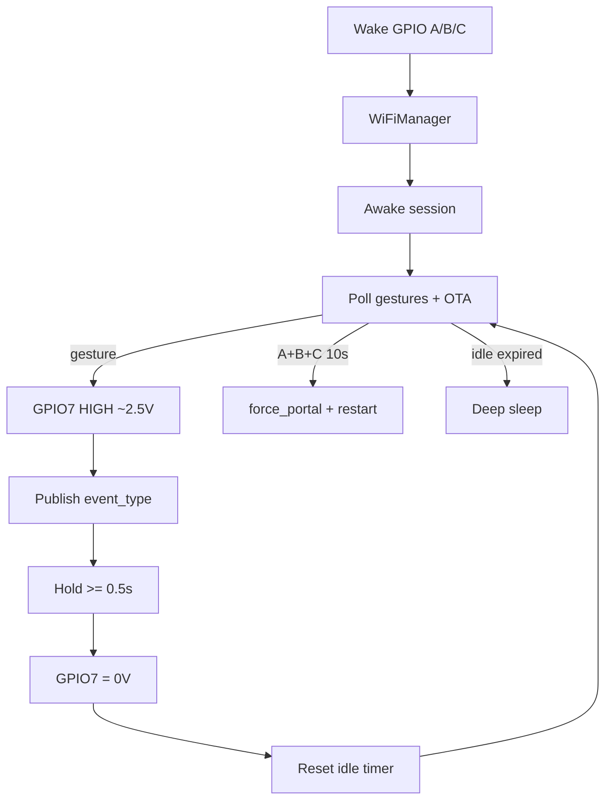

# Architecture

**Language:** [English](architecture.md) · [Português](../arquitetura.md)

## Flow

## Modules

| File | Role |
|------|------|
| `src/main.cpp` | Awake session, idle timer, OTA/MQTT/effect orchestration |
| `src/buttons.cpp` | A/B/C gesture poll + config chord |
| `src/wifi_setup.cpp` | WiFiManager, NVS, force_portal |
| `src/mqtt_ha.cpp` | Discovery + `event` publish |
| `src/ota_update.cpp` | ArduinoOTA |
| `src/effect_out.cpp` | GPIO7 PWM on/off ~2.5 V (hold ≥0.5 s) |
| `src/status_led.cpp` | Onboard LED GPIO8 |

## NVS persistence (`habutton`)

MQTT, names, `sleep_delay`, `ota_pass`, `force_portal`, `disc_done`.

## MQTT

- Discovery: `homeassistant/event/{deviceId}/config` (retained), with IP in `configuration_url` / `connections`.
- State: `{device}/{mac}/event` with `{"event_type":"..."}`.
- Config entities (switch/number/text) via classic discovery + `{base}/…/set` while awake.
- Connection stays up during the session; discovery is republished if config changes.

## Power / effect

- Effect only during MQTT publish.
- Deep sleep after idle; wake on GPIO4|5|3 low (only GPIO0–5 on C3).
