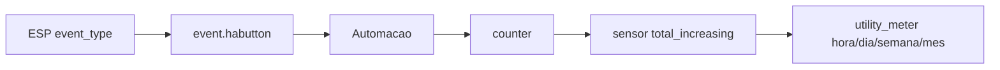

# Contadores de cliques no Home Assistant

Com a entidade única `event` do HAButton, conte por `event_type`.

## Fluxo



## 1) Counter (exemplo: press_a)

Helper → Contador → `counter.habutton_press_a`.

## 2) Automação

```yaml
automation:
  - id: habutton_count_press_a
    alias: "HAButton contar press_a"
    mode: queued
    trigger:
      - platform: state
        entity_id: event.habutton
    condition:
      - condition: template
        value_template: "{{ trigger.to_state.attributes.event_type == 'press_a' }}"
    action:
      - action: counter.increment
        target:
          entity_id: counter.habutton_press_a
```

Repita para `press_b`, `long_a`, `press_ab`, etc., conforme necessário.

> O `entity_id` real pode variar (`event.habutton_<mac>_event`). Confira em **Entidades**.

## 3) Template + Utility Meter

```yaml
template:
  - sensor:
      - name: "HAButton press_a total"
        unique_id: habutton_press_a_total
        state: "{{ states('counter.habutton_press_a') | int(0) }}"
        state_class: total_increasing
        unit_of_measurement: "cliques"

utility_meter:
  habutton_press_a_hourly:
    source: sensor.habutton_press_a_total
    cycle: hourly
  habutton_press_a_daily:
    source: sensor.habutton_press_a_total
    cycle: daily
  habutton_press_a_weekly:
    source: sensor.habutton_press_a_total
    cycle: weekly
  habutton_press_a_monthly:
    source: sensor.habutton_press_a_total
    cycle: monthly
```

## event_types disponíveis

`press_a/b/c`, `long_a/b/c`, `press_ab/ac/bc/abc`, `long_ab/ac/bc/abc`.
