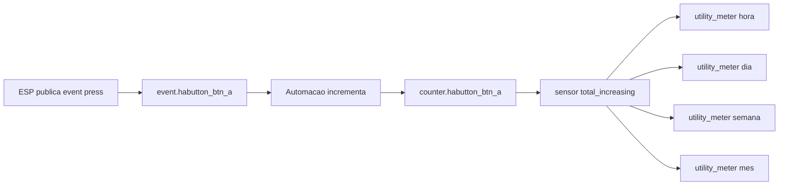

# Contadores de cliques no Home Assistant

## Por que não usar só `binary_sensor`?

| Abordagem | Adequação a “botão físico” | Contagem |
|-----------|----------------------------|----------|
| `binary_sensor` ON/OFF | Ruim (estado artificial) | Possível via `history_stats`, frágil |
| `event` (MQTT) | **Ideal** — clique é um evento | Automação → Counter → Utility Meter |
| `device_automation` trigger | Bom para automações do device | Menos direto para estatísticas |

O firmware publica entidades **`event`** com `event_type: press`.  
A contagem (hora/dia/semana/mês) fica no Home Assistant, não no ESP (economiza bateria e flash).

## Visão da estrutura



## 1) Helpers Counter (UI)

Em **Configurações → Dispositivos e serviços → Ajudantes → Criar ajudante → Contador**:

| Helper | Entity ID sugerido |
|--------|--------------------|
| HAButton A total | `counter.habutton_btn_a` |
| HAButton B total | `counter.habutton_btn_b` |

Passo mínimo 1; valor inicial 0.

## 2) Automações (incremento)

Exemplo para o botão A (`configuration.yaml` ou UI):

```yaml
automation:
  - id: habutton_btn_a_count
    alias: "HAButton A — contar clique"
    mode: queued
    trigger:
      - platform: state
        entity_id: event.habutton_btn_a
    condition:
      - condition: template
        value_template: "{{ trigger.to_state.attributes.event_type == 'press' }}"
    action:
      - action: counter.increment
        target:
          entity_id: counter.habutton_btn_a

  - id: habutton_btn_b_count
    alias: "HAButton B — contar clique"
    mode: queued
    trigger:
      - platform: state
        entity_id: event.habutton_btn_b
    condition:
      - condition: template
        value_template: "{{ trigger.to_state.attributes.event_type == 'press' }}"
    action:
      - action: counter.increment
        target:
          entity_id: counter.habutton_btn_b
```

> Tip: na UI, trigger **Estado** da entidade `event.*`; condição template como acima; ação **Counter: Increment**.

## 3) Sensor espelho com `state_class: total_increasing`

O `utility_meter` funciona melhor com um sensor numérico crescente. Crie um Template Sensor (UI **Ajudante → Modelo** ou YAML):

```yaml
template:
  - sensor:
      - name: "HAButton A cliques total"
        unique_id: habutton_btn_a_clicks_total
        state: "{{ states('counter.habutton_btn_a') | int(0) }}"
        state_class: total_increasing
        unit_of_measurement: "cliques"
        icon: mdi:gesture-tap-button

      - name: "HAButton B cliques total"
        unique_id: habutton_btn_b_clicks_total
        state: "{{ states('counter.habutton_btn_b') | int(0) }}"
        state_class: total_increasing
        unit_of_measurement: "cliques"
        icon: mdi:gesture-tap-button
```

## 4) Utility Meter — hora, dia, semana, mês

Via UI: **Ajudantes → Medidor de utilidade**, fonte = `sensor.habutton_a_cliques_total` (nome gerado), ciclos:

| Ciclo | Reset |
|-------|-------|
| Hourly | a cada hora |
| Daily | meia-noite |
| Weekly | início da semana |
| Monthly | início do mês |

YAML equivalente (botão A; repita para B):

```yaml
utility_meter:
  habutton_btn_a_hourly:
    source: sensor.habutton_a_cliques_total
    name: "HAButton A — hora"
    cycle: hourly

  habutton_btn_a_daily:
    source: sensor.habutton_a_cliques_total
    name: "HAButton A — dia"
    cycle: daily

  habutton_btn_a_weekly:
    source: sensor.habutton_a_cliques_total
    name: "HAButton A — semana"
    cycle: weekly

  habutton_btn_a_monthly:
    source: sensor.habutton_a_cliques_total
    name: "HAButton A — mes"
    cycle: monthly
```

Ajuste `source` para o `entity_id` real do template sensor (HA pode slugificar o nome).

## Alternativa: History Stats (sem Counter)

Se preferir estatística só pelo histórico do `event`/`binary_sensor`:

```yaml
sensor:
  - platform: history_stats
    name: "HAButton A presses hoje"
    entity_id: event.habutton_btn_a
    state: "press"
    type: count
    start: "{{ today_at('00:00') }}"
    end: "{{ now() }}"
```

Para `event`, o estado principal é um **timestamp**; o tipo fica no atributo `event_type`. Por isso a rota **Counter + Utility Meter** é mais previsível.

## Dashboard rápido

- Entidade `event.*` — último clique  
- `counter.*` — total absoluto  
- `sensor.*_hora/_dia/_semana/_mes` — períodos  

## Verificação

1. Pressione o botão físico.  
2. `event.habutton_btn_a` deve atualizar o horário do último evento.  
3. O counter sobe +1.  
4. Os utility meters refletem o incremento no ciclo atual.
