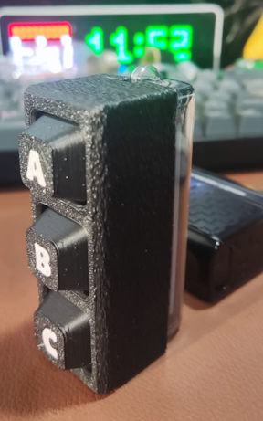
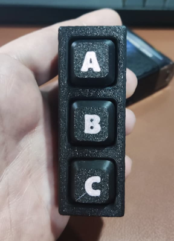
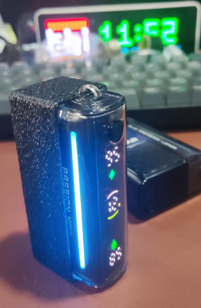

# HAButton

A quick project designed to repurpose used vapes into something useful: sending events to Home Assistant. It uses a small microcontroller powered by the vape's circuitry to monitor three mechanical switches. When one or more buttons are pressed, the device wakes up, connects to Wi-Fi, and publishes its status via MQTT. Home Assistant automatically recognizes the device and can be programmed to trigger automations based on the event data.
This is a quick weekend project—a first version with plenty of room for improvement.

**Docs:** [English](DOC/en/README.md) · [Português](DOC/README.md)

Build with Cursor, Grok-4.5 and PlatformIO - Firmware for **ESP32-C3 Super Mini**: 3 switches, awake session, MQTT gestures (Home Assistant), OTA, and LED effect pin.

--- 
<p align="center">
  
  
  
</p>

## Quick start

```bash
pio run
pio run -t upload
pio device monitor
```

- Portal: hold **A+B+C ~10 s** → AP `HAButton-XXXX`
- Default idle: **20 s** (restarts on each gesture)
- OTA: [English](DOC/en/ota.md) · [Português](DOC/ota.md)
- Full documentation: [English](DOC/en/README.md) · [Português](DOC/README.md)

## Hardware (summary)

| Function | GPIO |
|----------|------|
| Buttons A/B/C | 4 / 5 / 3 |
| Effect LED | 7 (PWM ~2.5 V) |
| Status LED | 8 |

Firmware version: **1.4.2** (`include/config.h`)

---

## Português

Firmware PlatformIO para **ESP32-C3 Super Mini**: 3 switches, sessão acordada, gestos MQTT (Home Assistant), OTA e pino de efeito LED.

Documentação completa: [DOC/README.md](DOC/README.md).
